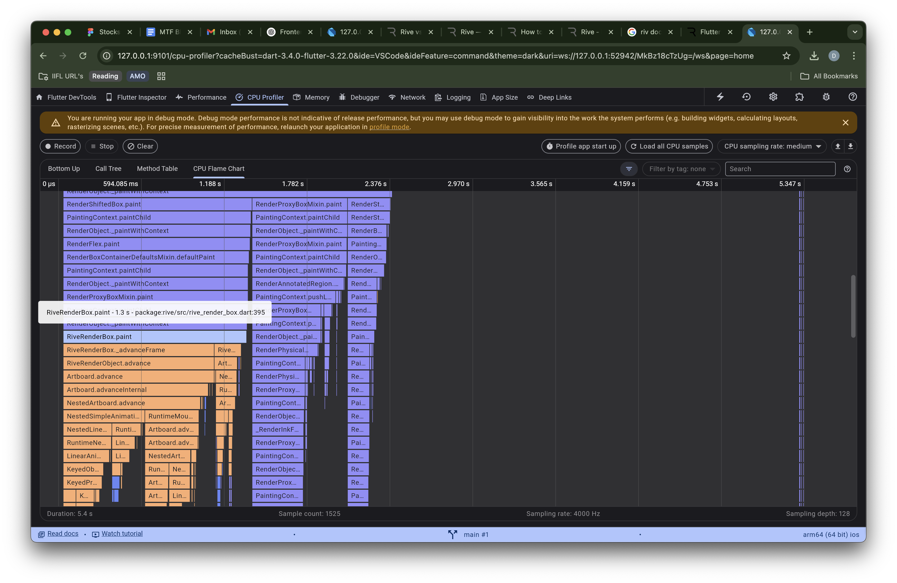
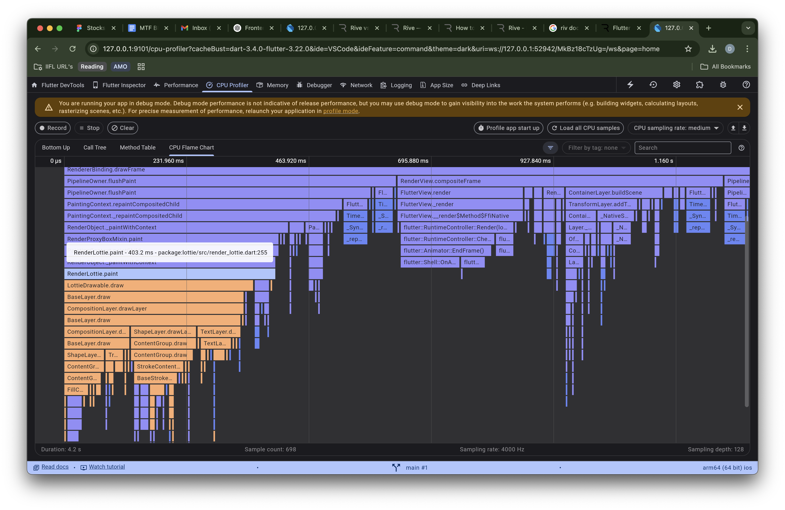

# Animation Performance Comparison: Rive vs Lottie

This repository contains a performance comparison of two popular animation tools used in Flutter: **Rive** and **Lottie**. The analysis was done using Flutter's **DevTools CPU Profiler** to measure the painting phase performance for each animation asset.

## Summary

| Animation Tool | Paint Phase Duration | Asset Size |
|----------------|----------------------|------------|
| **Rive**       | 1.3 s                | 52 KB      |
| **Lottie**     | 0.4 s                | 451 KB     |

---

##  Observations

- **Rive** animation, while lightweight in file size, is **more CPU intensive** during the paint phase.
- **Lottie** animation, despite being heavier in size, is **less demanding on CPU**, showing quicker rendering.
- Rive’s `RiveRenderBox.paint` took **1.3s**, while Lottie’s `RenderLottie.paint` took only **403ms**.
- These measurements were collected in **debug mode**, so final results might vary in **profile or release mode**.
- **Lottie** is approximately **3× faster** than **Rive** in terms of paint performance.
- **Rive** is approximately **9× smaller** than **Lottie** in file size.

---

## Inspector

| Tool        | CPU Flame Chart  |
|-------------|------------------------|
| **Rive**    |  |
| **Lottie**  |  |